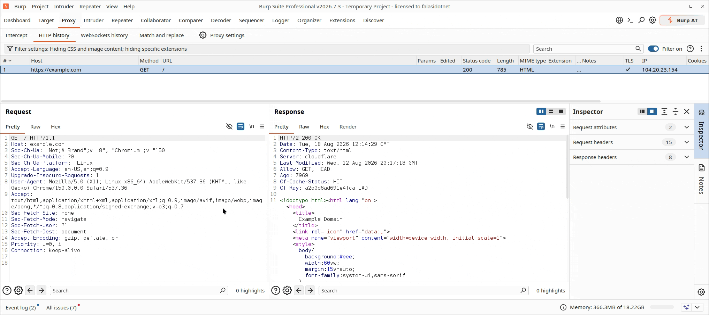

# Repeater Tab Renamer



A Burp Suite extension (Montoya API) that names Repeater tabs for you,
instead of leaving them as "1", "2", "3", ... It does this three ways:

- **Automatically**, based on the request's path/body/host, every time
  you send from a Repeater tab.
- **From a selection**, in Repeater itself — select text, right-click or
  hit a hotkey, and the tab is renamed to that text.
- **From Proxy's HTTP history**, in one step — select text, hit a hotkey,
  and the request is sent straight to a new, already-named Repeater tab.

[Download the latest release](https://github.com/falasi/RepeaterTabRenamer/releases/latest)

## Requirements

- Burp Suite with Montoya API support (any release from 2023.9 onward)
  for auto-naming and the right-click menu item.
- A more recent release for the two hotkeys — see
  [Changing the hotkeys](#changing-the-hotkeys) for the exact version and
  what happens on an older Burp without it (nothing breaks; the hotkeys
  just aren't available).
- JDK 17+ only to build from source — not needed to just load the jar.

## Naming logic

1. **Path first.** The last segment of the request path is used as the tab
   name, e.g. `/this/is/a/path` → `path`. This applies to every method,
   including POST/PUT/PATCH/DELETE — most APIs already have distinctive
   paths (`/api/users/login` → `login`), so this alone covers the common
   case cleanly.
2. **Body fallback for generic paths.** If the request has a body (i.e. the
   method isn't GET/HEAD) *and* the path is too generic to distinguish
   requests on its own (empty, `/`, `/api`, `/graphql`, `/rpc`, `/v1`,
   etc.), the extension looks at the body instead:
   - JSON bodies: checks a priority list of likely-identifying fields
     (`operationName` — handy for GraphQL, `action`, `method`, `type`,
     `event`, `name`, `username`, `email`, `id`), falling back to the
     first field in the body if none of those are present.
   - `application/x-www-form-urlencoded` bodies: uses the first
     `key=value` pair.
   - If nothing usable is found, it falls back to the path segment anyway.
3. **Host fallback for empty paths.** If there's no usable path segment at
   all — root path `/` or literally empty, and no body field was
   extractable either — the tab is named after the target host instead
   (e.g. `example.com`) rather than a generic literal like `request`.
   That keeps tabs distinguishable when you've got several open against
   different hosts' root paths, which a fixed placeholder name can't do.
4. Names are sanitized (invalid characters replaced with `-`) and capped
   at 40 characters.
5. A tab is only renamed while its title still looks auto-generated (a
   plain number, "Untitled...", or empty) — once it's been renamed (by
   this extension or by hand) it's left alone, so re-sending a request in
   the same tab won't clobber a name you set yourself.

## Naming a tab manually

There are two hotkeys, plus a right-click menu item, covering every place
selected text can come from. Both hotkeys always overwrite the tab's
current title, even if you'd already renamed it — they're explicit
actions, so they're expected to win.

**Ctrl+Alt+R** (falls back to **Ctrl+Shift+R** if taken — see
[Changing the hotkeys](#changing-the-hotkeys)) fires in *any* focused
message editor pane, and adapts to where that message came from:

- **In Repeater** — renames the active tab from the selection. Also
  reachable by selecting text, right-clicking it, and choosing
  **Use selection as Repeater tab name** (nested under the "Extensions"
  submenu — see below for why).
- **Anywhere else** (Proxy history's viewer, Intruder's, ...) — sends the
  message to a new, already-named Repeater tab instead, the same as the
  hotkey below. Works with nothing selected too, falling back to the
  same auto-naming `RepeaterRequestHandler` uses (path/body/host).

**Ctrl+Alt+S** (falls back to **Ctrl+Shift+S**) covers the one case the
first hotkey can't: a Proxy history row that's *selected but whose
editor pane isn't focused* — clicking a row keeps focus on the table
itself, not its viewer, and Burp scopes hotkeys by whichever specific
component has focus. Selecting a row and pressing Ctrl+Alt+S sends it to
a new, already-named Repeater tab; clicking into the viewer and
selecting text there is Ctrl+Alt+R's job instead (first bullet above).

Both send-to-Repeater paths skip `RepeaterTabTitler`'s Swing-walking
heuristic entirely — Montoya's own `Repeater.sendToRepeater(request,
name)` names the tab it creates, since the extension is the one creating
it, so there's nothing to search the UI for.

### Changing the hotkeys

Ctrl+Alt+R and Ctrl+Alt+S are the first choice for each, but Burp
validates hotkey bindings globally — if another extension (Hackvertor's
default bindings are a common culprit) already claims one, registration
falls back automatically to Ctrl+Shift+R / Ctrl+Shift+S. There's no API
to check whether a combo is free ahead of time, so this is a reactive
try-then-fall-back: attempt the first choice, and only try the fallback
if Burp rejects it. Beyond that one fallback, it's not retried further —
if both candidates are taken, the hotkey simply won't register (see
below for how that's reported), and the right-click menu item still
covers the Repeater-editor case regardless.

Whichever combo ends up bound, it can always be changed: Burp Suite →
**Settings → Hotkeys**, find "Use selection as Repeater tab name" or
"Send to Repeater (named from selection)" (both also searchable from the
command palette), and assign whatever key combo you prefer. This uses
Montoya's actual hotkey-registration API (`registerHotKeyHandler`) rather
than an extension-owned global listener, so both show up in Burp's own
hotkey UI like first-class commands.

The Proxy-history hotkey needs montoya-api **2025.12** specifically
(`HotKeyContext.PROXY_HTTP_HISTORY` and
`HotKeyEvent.selectedRequestResponses()` were both added there — 2025.11
only had the Repeater-editor one). On an older Burp install, hotkey
registration silently fails at load time and only the right-click menu
item is available; everything else in the extension still works
normally.

Each hotkey is also registered independently: if one fails entirely (both
its candidate combos already claimed) that doesn't stop the other one
from registering. The extension's **Output** tab logs the outcome for
each hotkey on load, right under "Repeater Tab Renamer loaded." — the combo
it actually registered with, unsupported on this Burp version, or failed
to register (check the Errors log for why). That logged combo reflects
what was requested *at load time* only: Montoya doesn't expose a way to
read back a hotkey's current binding after it's been rebound, so if
you've changed one since, Settings → Hotkeys is the source of truth, not
the Output log.

## How it works / limitations

Burp's public (Montoya) API only lets an extension name a tab **it**
creates via `Repeater.sendToRepeater(request, name)`. There's no
supported API to rename a tab that already exists — e.g. one created via
"Send to Repeater" from Proxy/Target, which is the common case this
extension targets.

To handle that, the extension registers an HTTP handler that fires when a
request is about to be sent *from Repeater* (i.e. when you hit Send), and
then walks the Swing UI component tree from the currently focused
component outward to find the Repeater request-tab strip and retitle the
selected tab. This means:

- Renaming happens on **first send**, not the moment a tab is created.
- It relies on Burp's internal UI structure rather than a documented API.
  It's a best-effort heuristic (used by several similar community
  extensions) and could need adjusting if a future Burp release
  restructures that UI — if renaming silently stops working, check the
  extension's Output tab in Burp for errors first.

The manual "use selection as tab name" menu item and hotkey don't have
this problem — they're built entirely on Montoya's documented selection
APIs (`ContextMenuItemsProvider` / `registerHotKeyHandler`, both handing
back a `MessageEditorHttpRequestResponse`), which report exactly what's
selected and in which pane. One subtlety: Burp reports the request pane
and response pane as different `InvocationType`s depending on whether
that pane is editable (`MESSAGE_EDITOR_*`) or read-only
(`MESSAGE_VIEWER_*`) — Repeater's response pane in particular shows up as
a viewer, not an editor. The context menu provider listens for both, so
the menu item appears regardless of which pane you select text in.

Also worth knowing: Burp nests **every** extension's context-menu items
under an "Extensions" submenu (grouped by extension name) rather than the
top-level right-click menu — that's standard Burp UI behavior for all
extensions, not something Montoya lets an extension opt out of. The
hotkey is the way to skip that navigation entirely.

## Build

Requires JDK 17+.

```bash
./gradlew build
```

The extension jar is produced at
`build/libs/repeater-tab-renamer-<version>.jar`. It only contains this
extension's own classes — the Montoya API classes are provided by Burp
itself at runtime, so nothing needs to be shaded/bundled.

Run tests only:

```bash
./gradlew test
```

## Load into Burp

Burp Suite → Extensions → Installed → Add → Extension type: **Java** →
select the built jar.

## Project layout

- `TabNameGenerator` — pure naming logic (method/path/content-type/body →
  tab name, plus sanitizing arbitrary selected text), unit tested
  independently of the Burp API.
- `RepeaterRequestHandler` — Montoya `HttpHandler` that detects
  Repeater-sourced requests and asks for the tab to be auto-renamed.
- `RepeaterSelectionContextMenuProvider` — right-click "use selection as
  tab name" menu item.
- `MessageEditorSelectionHotKeyHandler` — the Ctrl+Alt+R hotkey: fires in
  any focused message editor, renaming the tab if the message is from
  Repeater or delegating to `SendToRepeaterHotKeyHandler` otherwise.
- `SendToRepeaterHotKeyHandler` — sends a request to a new, already-named
  Repeater tab via `Repeater.sendToRepeater(request, name)`. Used both as
  the standalone Ctrl+Alt+S hotkey (Proxy history row selected, no editor
  focused) and internally by `MessageEditorSelectionHotKeyHandler`.
- `EditorSelection` — shared logic for pulling the selected text out of a
  `MessageEditorHttpRequestResponse`, used by all of the above.
- `RepeaterTabTitler` — the Swing UI heuristic that locates and retitles
  the active Repeater tab.
- `RepeaterTabRenamerExtension` — extension entry point.

## License

[MIT](LICENSE)
